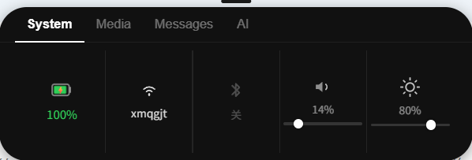
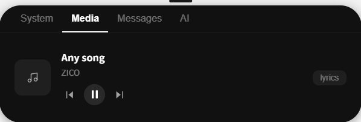
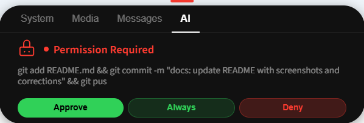
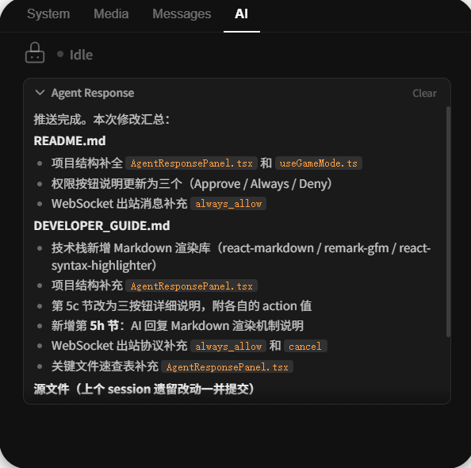

# Windows Island

> 仿 macOS Dynamic Island 风格的 Windows 顶部状态栏 HUD，基于 Tauri + React + TypeScript 构建。

---

## 效果预览

> 
>
> 
>
> 
>
> 

平时收缩为屏幕顶部中央的一条短横线，鼠标悬停时展开为药丸形状的信息面板。

```
收缩状态：  ——————
展开状态：  ╭──────────────────────────────╮
            │  System  Media  Msg  AI       │
            │  🔋92%  📶WiFi  🔊60%  ☀️80%  │
            ╰──────────────────────────────╯
```

---

## 功能特性

| 功能 | 说明 |
|------|------|
| 🔋 **系统状态** | 电池、WiFi 信号、音量、屏幕亮度、蓝牙 |
| 🎵 **媒体控制** | 读取 Windows SMTC，支持播放/暂停/切曲 |
| 🔔 **系统通知** | 实时读取 Windows 通知，新通知自动弹出（暂未实现） |
| 🤖 **AI 集成** | 与 Claude Code 深度集成，可在面板内审批/回复/发起新对话 |
| 🎮 **游戏模式** | 检测全屏页面，自动禁用悬停展开 |

---

## 技术栈

| 层 | 技术 |
|----|------|
| 应用框架 | [Tauri v2](https://tauri.app/)（Rust 后端 + WebView2 前端） |
| 前端 | React 18 + TypeScript + Vite |
| 动画 | Framer Motion |
| 后端语言 | Rust 2021 |
| Windows API | `windows` crate（Win32 + WinRT） |
| 异步运行时 | Tokio |
| WebSocket | tokio-tungstenite |
| 系统通知 | rusqlite（读取 Windows 通知数据库） |

---

## 快速开始

### 前置要求

- [Node.js](https://nodejs.org/) >= 18
- [Rust](https://rustup.rs/)（stable）
- Windows 10 / 11

### 安装与运行

```bash
# 克隆项目
git clone https://github.com/Kyrie5e/Windows-Island.git
cd Windows-Island

# 安装前端依赖
npm install

# 开发模式（热重载）
npm run tauri dev

# 生产构建
npm run tauri build
```

构建产物位于 `src-tauri/target/release/` 目录。

---

## Claude Code 集成

Windows Island 可作为 Claude Code 的可视化状态面板：当 Claude 正在执行工具、等待审批时，面板自动弹出并播放提示音。

### 工作原理

```
Claude Code (hooks) → PowerShell → WebSocket → Rust → 前端面板
```

1. Claude Code 通过 `PreToolUse` / `Stop` hooks 调用 PowerShell 脚本
2. 脚本将状态通过 WebSocket 推送到 `ws://127.0.0.1:27182`
3. 面板自动展开，切换到 AI Tab，显示当前状态
4. 用户可在面板内点击 **Approve / Always / Deny**，或直接输入回复；AI 完成回复后，面板底部始终显示输入框，可直接发起新对话

### WebSocket 协议

**客户端 → Island（状态推送）：**
```json
{ "state": "tool_use", "tool": "Bash", "message": "cargo build" }
{ "state": "waiting_review", "message": "请确认这段代码" }
{ "state": "permission_required", "message": "需要执行危险操作" }
{ "state": "idle" }
```

**Island → 客户端（用户响应）：**
```json
{ "action": "approve" }
{ "action": "always_allow" }
{ "action": "deny" }
{ "action": "ask", "message": "用户输入的内容" }
```

详细集成配置请参阅 [DEVELOPER_GUIDE.md](./DEVELOPER_GUIDE.md#claude-code-hooks-集成)。

---

## 项目结构

```
Windows-Island/
├── src/                    # 前端 React/TypeScript
│   ├── App.tsx             # 根组件：展开/收缩逻辑
│   ├── components/
│   │   ├── ExpandedPanel.tsx       # 展开面板 + Tab 导航
│   │   ├── AgentResponsePanel.tsx  # AI 回复展示面板（Markdown 渲染）
│   │   └── tabs/
│   │       ├── SystemTab.tsx   # 系统状态
│   │       ├── MediaTab.tsx    # 媒体控制
│   │       ├── MessagesTab.tsx # 系统通知
│   │       └── AITab.tsx       # Claude Code 集成
│   ├── hooks/
│   │   ├── useSystemData.ts    # 系统数据轮询（每 3 秒）
│   │   └── useGameMode.ts      # 游戏模式检测
│   └── lib/tauri.ts            # Tauri IPC 封装
│
└── src-tauri/              # Rust 后端
    └── src/
        ├── commands/       # 各功能模块
        │   ├── agent.rs    # WebSocket 服务器
        │   ├── battery.rs  # 电池信息
        │   ├── media.rs    # 媒体控制
        │   └── ...\
        └── window.rs       # 窗口 + 光标追踪
```

---

## 已知问题

- 暂不支持多显示器（固定显示在主显示器）
- WebSocket 仅支持单客户端连接
- 无系统托盘图标（关闭需通过任务管理器）

---

## License

MIT
